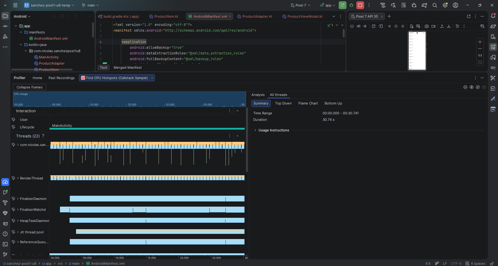
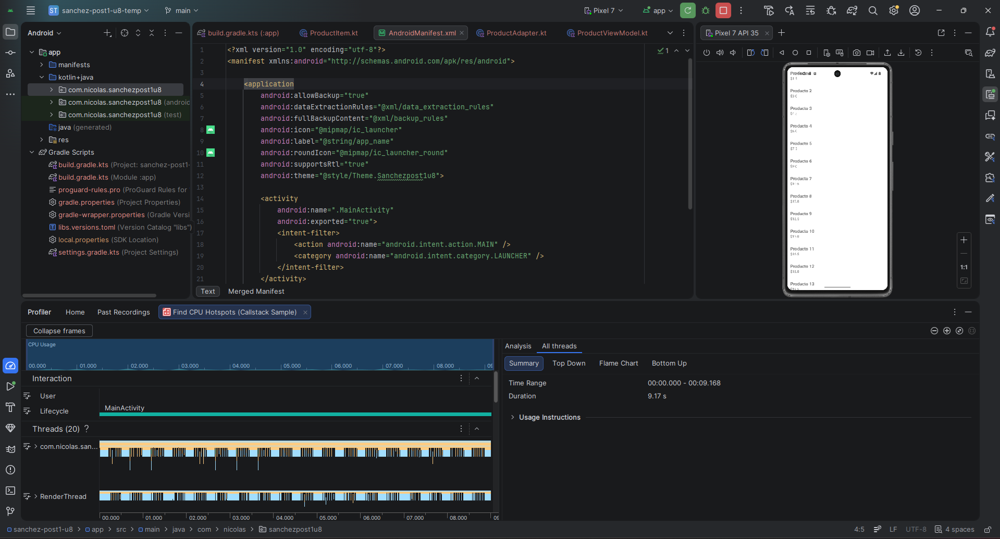
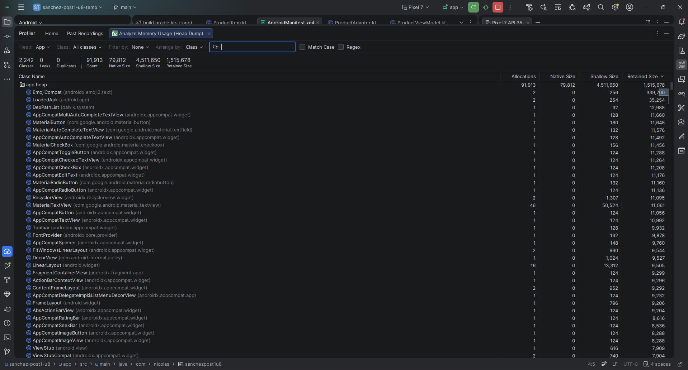

# sanchez-post1-u8

## Unidad 8 - Rendimiento, Optimización y Experiencia Fluida

Aplicación Android en Kotlin que demuestra optimización de rendimiento usando RecyclerView, Android Profiler, DiffUtil, ListAdapter y limpieza de recursos.

## Objetivo

Detectar un problema de rendimiento causado por actualizaciones ineficientes con `notifyDataSetChanged()`, medirlo con Android Profiler y luego optimizarlo usando `DiffUtil` y `ListAdapter`.

## Implementación

- Se creó una lista de 500 productos en un RecyclerView.
- La primera versión usaba `notifyDataSetChanged()`, redibujando toda la lista.
- La versión optimizada usa `DiffUtil` con `ListAdapter`.
- Se agregó `setHasFixedSize(true)` para mejorar el rendimiento del RecyclerView.
- Se agregaron trazas con `Trace.beginSection()`.
- Se limpia el adaptador en `onDestroy()` para evitar referencias innecesarias.

## Capturas del Profiler

### CPU Profiler antes de DiffUtil

### CPU Profiler después de DiffUtil

### Memory Profiler

## Conclusión

Con DiffUtil y ListAdapter, la aplicación evita redibujar los 500 elementos del RecyclerView en cada actualización. Solo se actualiza el producto que cambia, reduciendo el trabajo innecesario del adaptador y mejorando el comportamiento observado en Android Profiler.
